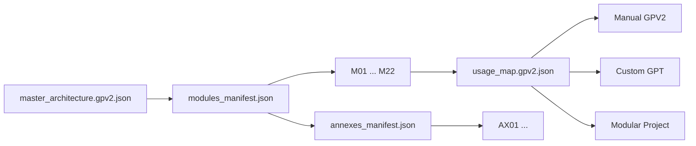

# ORA_CORE_OS

Structured AI architecture in `GPV2`: 22 core modules, one canonical install order, one public spec, and optional annex extensions.

## Why This Repository Exists

`ORA_CORE_OS` is published here to make the architecture:
- readable
- installable
- modular
- verifiable

This repo is for people who want a clear source of truth for:
- core module order
- dependency wiring
- public install paths
- output and truth constraints
- optional annex extensions that do not break the 22-core base

## What You Get

- a public specification
- a single-file GPV2 core reference
- one GPV2 file per core module
- optional annex modules for targeted extensions
- a manual installation guide
- a Custom GPT installation guide
- a quickstart for first evaluation

## Start Here

1. [Quickstart](docs/QUICKSTART.md)
2. [Public Spec](docs/ORA_CORE_OS_PUBLIC_SPEC.md)
3. [Manual Install](docs/INSTALL_MANUAL_GPV2.md)
4. [Custom GPT Install](docs/INSTALL_CUSTOM_GPT.md)
5. [GPV2 Index](docs/GPV2/README.md)

## Choose Your Path

| Path | Use it when | Start file |
| --- | --- | --- |
| Quick evaluation | You want to understand the repo in a few minutes | [docs/QUICKSTART.md](docs/QUICKSTART.md) |
| Manual GPV2 install | You want full control over files and wiring | [docs/INSTALL_MANUAL_GPV2.md](docs/INSTALL_MANUAL_GPV2.md) |
| Custom GPT install | You want to port the architecture into ChatGPT | [docs/INSTALL_CUSTOM_GPT.md](docs/INSTALL_CUSTOM_GPT.md) |
| Modular inspection | You want to inspect each core module separately | [docs/GPV2/modules/README.md](docs/GPV2/modules/README.md) |
| Optional extensions | You want add-on modules without changing the 22-core base | [docs/GPV2/annexes/README.md](docs/GPV2/annexes/README.md) |

## Architecture Flow

## Architecture At A Glance

Section groups:
- `S1` orchestration and governance
- `S2` positioning and signal shaping
- `S3` memory and learning
- `S4` production pipeline

Core rules:
- `CODE_POS` is the canonical install order for the 22 core modules
- `DEPENDS_ON` defines required upstream links
- `GPV2` is the structural source of truth
- `NATIVE_FINAL` must not add facts unsupported by `GL`
- annexes are optional and must not silently alter the core graph

## Repository Map

- [docs/QUICKSTART.md](docs/QUICKSTART.md)
Fastest entry path for new readers.

- [docs/ORA_CORE_OS_PUBLIC_SPEC.md](docs/ORA_CORE_OS_PUBLIC_SPEC.md)
Reference scope, invariants, structure, and public rules.

- [docs/ORA_CORE_OS_22_Modules_GPV2.md](docs/ORA_CORE_OS_22_Modules_GPV2.md)
Single-file reference for the 22-core architecture.

- [docs/INSTALL_MANUAL_GPV2.md](docs/INSTALL_MANUAL_GPV2.md)
Manual installation guide.

- [docs/INSTALL_CUSTOM_GPT.md](docs/INSTALL_CUSTOM_GPT.md)
Custom GPT installation guide.

- [docs/GPV2/README.md](docs/GPV2/README.md)
Entry point for the modular GPV2 layout.

- [docs/GPV2/modules_manifest.json](docs/GPV2/modules_manifest.json)
Machine-readable core module index and install order.

- [docs/GPV2/annexes_manifest.json](docs/GPV2/annexes_manifest.json)
Machine-readable optional annex index.

- [docs/GPV2/modules/README.md](docs/GPV2/modules/README.md)
Human-readable core module index.

- [docs/GPV2/annexes/README.md](docs/GPV2/annexes/README.md)
Human-readable optional annex index.

## Public Scope

This public repository stays limited to:
- `ORA_CORE_OS`
- installable GPV2 files
- optional annexes that explicitly extend ORA_CORE_OS
- documentation required to study or install the architecture

Anything outside that scope stays out of the repo.

## For Contributors

See [CONTRIBUTING.md](CONTRIBUTING.md) before opening a change.

## License

See [LICENSE](LICENSE).
